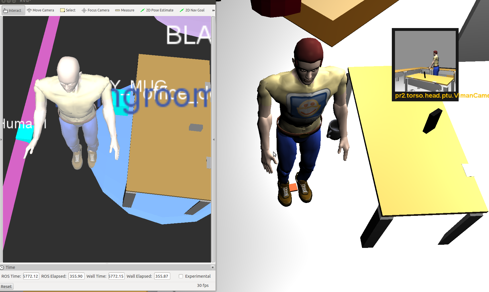
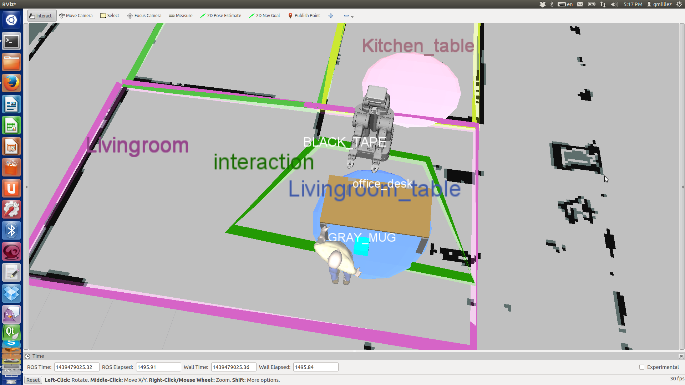

toaster
=======

Tracking Of Agent (actions and belief) and Spatio-TEmporal Reasoning.

The human from [morse](https://www.openrobots.org/morse/doc/stable/morse.html) import in toaster and visualized using rviz

A scenario using data input from real world:

This framework provides ros nodes that play a specific role in building situation assessment 
for the robot to understand its surrounding environment and have spatio-temporal reasoning on
agents actions and belief.

The framework is built in a modular way so that it would be easy to extend the reasoning
by including new type of data input, new kind of reasoning or new hypothesis for the situation
assessment.

This framework could be used for various application, from navigation to joint action,
from situated dialogue to temporal reasoning on events.

Nodes included :
----------------

pdg : Perception Data Gathering
This node will collect all the perception data (agents configuration, object positions...).
These data will be cast in toaster-lib data types and send in topics.

area_manager :
This node will use the data from pdg to compute geometric facts concerning the environment.
It creates dynamic area in which some specific computation will be performed.
As an example, we could put an interaction area on the robot and compute the human orientation when he enters this area.

agent_monitor :
This node is using data from pdg to compute spatio-temporal facts concerning a set of agent, such as his motion.

belief_manager :
This node is managing a list of facts for agents involved in the scenario.
It allows to enhance divergent belief management for the robot.

toaster_visualizer :
This node sends marker to rviz to visualize toaster's data.

toaster_simu :
This node simulate the entity positions. You can either set the object position or move them with keyboard

database_manager :
This node is an improvement of belief_manager node. It uses a sql database to store facts, static properties and onthology.
It provide a set of services and also allow direct sql request.

A [complete documentation](https://github.com/Greg8978/toaster/wiki) is available.
